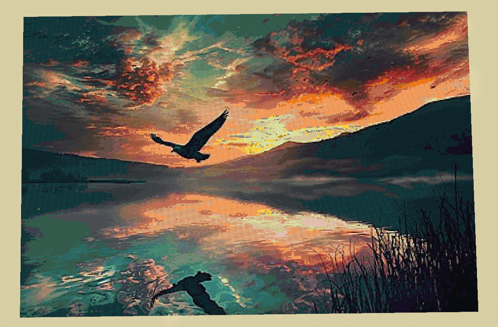
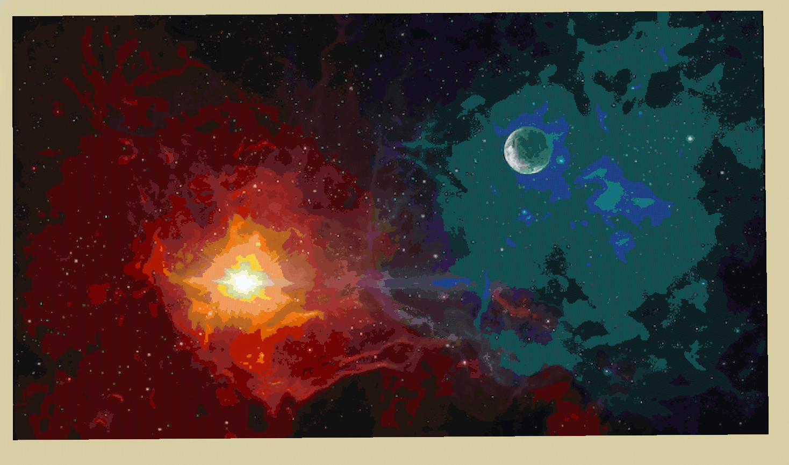

# img2mc

## Preview

<p align=center>
  
  
</p>

## Description

The program replaces each pixel with the corresponding block in Minecraft.
File that **img2mc** generates is a function that you run in Minecraft
to build your image.

> [!WARNING]
> Make sure that `/gamerule maxCommandChainLength <required_count>`.
> The program will notice you about the generated command count.
> So copy the number from there

## Get started

First of all you need to generate `blocks.odin` file using `generator`. The
generator creates array of block names with their average color. To generate
that file you need to put `block_states`, `block_models`, `block_textures`
folders into the `generator` folder. You may find block states, models and
textures by unzipping `<your_version>.jar`. On Linux you can find this file
in `.minecraft/versions`, on Windows maybe AppData, idk. Rename folder names they
must be `block_states`, `block_models`, `block_textures`. So you have
`generator/block_states`, `generator/block_models`, `generator/block_textures`.
Go to `generator` folder and run: 

``` console
odin run .
```

Then jump back. Check there must be `blocks.odin`. Build the actual program:

``` console
odin build .
```

There you go:

``` console
./img2mc
```
